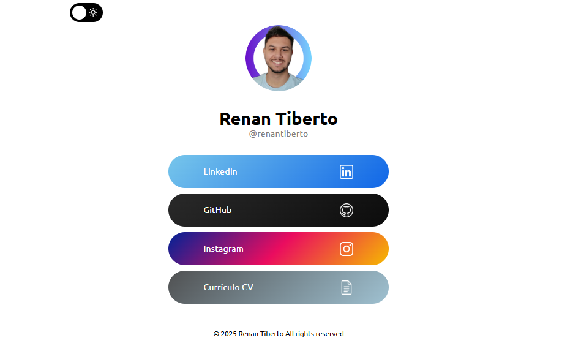

# Renan Tiberto - Linktree

<!-- Adicione aqui uma captura de tela do projeto -->


## 📋 Descrição

Este é o repositório do meu site pessoal de links, uma página web simples e elegante que centraliza todos os meus links profissionais e redes sociais em um único local. O projeto serve como uma landing page digital para facilitar o acesso aos meus perfis online.

## ✨ Funcionalidades

- **Design Responsivo**: Adaptável para diferentes tamanhos de tela
- **Tema Claro/Escuro**: Alternância entre modos de visualização
- **Links Centralizados**: Acesso rápido ao LinkedIn, GitHub, Instagram e currículo
- **Interface Moderna**: Design limpo e profissional
- **Performance Otimizada**: Carregamento rápido e eficiente

## 🛠️ Tecnologias Utilizadas

- HTML5
- CSS3
- JavaScript
- Google Fonts (Ubuntu)
- Font Awesome Icons

## 🚀 Como Executar

Acesse diretamente: [renantiberto.github.io](https://renantiberto.github.io)

## 📁 Estrutura do Projeto

```
renantiberto.github.io/
├── assets/
│   ├── images/
│   │   ├── profile/
│   │   │   ├── profile-pic.png
│   │   │   └── profile.jpeg
│   │   ├── icons/
│   │   │   ├── linkedin.png
│   │   │   ├── github.png
│   │   │   ├── instagram.png
│   │   │   ├── facebook.png
│   │   │   ├── twitter.png
│   │   │   └── docs_cv.png
│   │   └── screenshots/
│   │       └── screenshot.png
│   ├── docs/
│   │   └── resume/
│   │       └── curriculo.pdf
│   ├── scripts/
│   │   └── main.js
│   └── styles/
│       └── main.css
├── index.html
└── README.md
```

## 👤 Autor

**Renan Tiberto**

- GitHub: [@renantiberto](https://github.com/renantiberto/)

---

© 2025 Renan Tiberto. Todos os direitos reservados.
